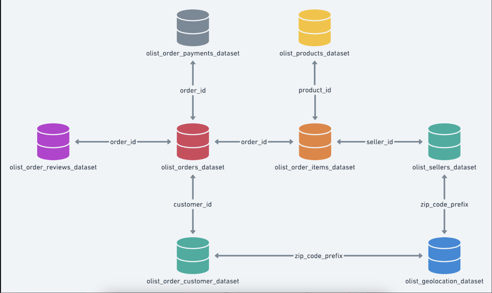

# Target Retail Stores Data Analysis
Target is a globally renowned brand and a prominent retailer in the United States. Target makes itself a preferred shopping destination by offering outstanding value, inspiration, innovation and an exceptional guest experience that no other retailer can deliver.

This particular business case focuses on the operations of Target in Brazil and provides insightful information about 100,000 orders placed between 2016 and 2018. The dataset offers a comprehensive view of various dimensions including the order status, price, payment and freight performance, customer location, product attributes, and customer reviews.

By analyzing this extensive dataset, it becomes possible to gain valuable insights into Target's operations in Brazil. The information can shed light on various aspects of the business, such as order processing, pricing strategies, payment and shipping efficiency, customer demographics, product characteristics, and customer satisfaction levels

**Dataset schema:**

**Problem Statement:**

Assuming you are a data analyst/ scientist at Target, you have been assigned the task of analyzing the given dataset to extract valuable insights and provide actionable recommendations.

**1. Apply Exploratory analysis steps like checking the structure & characteristics of the dataset:**

   - Data type of all columns in the "customers" table. -

   - Get the time range between which the orders were placed.

   - Count the Cities & States of customers who ordered during the given period.

**2. In-depth Exploration:**

- Is there a growing trend in the no. of orders placed over the past years?
  
- Can we see some kind of monthly seasonality in terms of the no. of orders being placed?
  
- During what time of the day, do the Brazilian customers mostly place their orders? (Dawn, Morning, Afternoon or Night)

0-6 hrs : Dawn

7-12 hrs : Mornings

13-18 hrs : Afternoon

19-23 hrs : Night

**3. Evolution of E-commerce orders in the Brazil region:**

- Get the month on month no. of orders placed in each state.
  
- How are the customers distributed across all the states?
  
**4. Impact on Economy: Analyze the money movement by e-commerce by looking at order prices, freight and others.**
  
- Get the % increase in the cost of orders from year 2017 to 2018 (include months between Jan to Aug only).
  You can use the "payment_value" column in the payments table to get the cost of orders.
  
- Calculate the Total & Average value of order price for each state.
  
- Calculate the Total & Average value of order freight for each state.
  
**5. Analysis based on sales, freight and delivery time.**

- Find the no. of days taken to deliver each order from the order’s purchase date as delivery time.
Also, calculate the difference (in days) between the estimated & actual delivery date of an order.
Do this in a single query.You can calculate the delivery time and the difference between the estimated & actual delivery date using the given formula:

**time_to_deliver** = order_delivered_customer_date - order_purchase_timestamp

**diff_estimated_delivery** = order_estimated_delivery_date - order_delivered_customer_date

- Find out the top 5 states with the highest & lowest average freight value.
  
- Find out the top 5 states with the highest & lowest average delivery time.
  
- Find out the top 5 states where the order delivery is really fast as compared to the estimated date of delivery.
You can use the difference between the averages of actual & estimated delivery date to figure out how fast the delivery was for each state.

**6. Analysis based on the payments:**

- Find the month on month no. of orders placed using different payment types.
  
- Find the no. of orders placed on the basis of the payment installments that have been paid.
