**1. Importing the dataset and analysing the structure & characteristics of the dataset
**
~~~ SQL
/*1.1 Data type of columns in a table*/
/*customers*/

SELECT * FROM target.INFORMATION_SCHEMA.COLUMNS
WHERE table_name = 'customers';

~~~
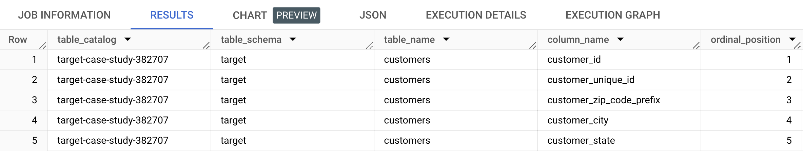

~~~ SQL
/*Code to count row numbers*/

SELECT COUNT(*) AS num_rows
FROM `target-case-study-382707.target.customers`;
~~~
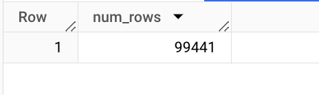

~~~ SQL
/*1.2Time period for which the data is given*/

SELECT
   min(order_purchase_timestamp) AS start_time,
   max(order_purchase_timestamp) AS end_time
FROM `target-case-study-382707.target.orders`;
~~~
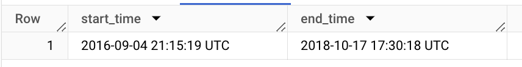

**The order_purchase_timestamp in the orders table contains the timestamp of each purchase. To get the range we need to find the timestamp of the first and the last purchase, for which we can apply the MIN and MAX functions on order_purchase_timestamp respectively. 
**So we can see that the range of the given data set is 2016-09-04 21:15:19 UTC - 2018-10-17 17:30:18 UTC.

~~~ SQL
/*1.3 Cities and States of customers who ordered during the given period*/
/*States and Cities*/
SELECT Distinct geolocation_state, geolocation_city
FROM `target-case-study-382707.target.geolocation`
~~~
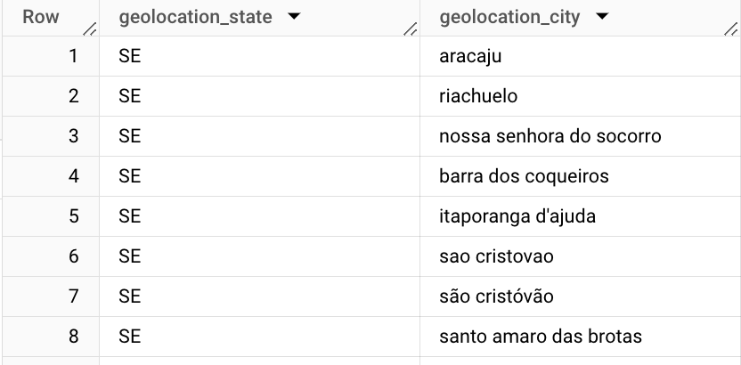

**2. In-depth Exploration**

**2.1 To check if there is any growing trend on e-commerce in Brazil. Description of the complete scenario.**

**2.2 To check of there are some seasonality with peaks at specific months.**

~~~ SQL
SELECT
 EXTRACT(MONTH FROM order_purchase_timestamp) AS Month,
 EXTRACT(YEAR FROM order_purchase_timestamp) AS Year,
 COUNT(order_id) AS CountOfOrders
FROM `target-case-study-382707.target.orders`
WHERE order_status = 'delivered'
GROUP BY Month,Year
ORDER BY Year,Month;
~~~
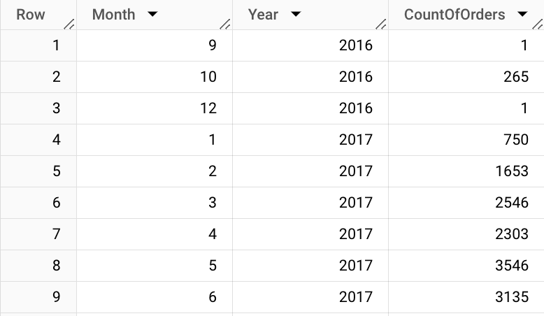

ASSUMPTION: Only counting the orders that were delivered

INSIGHT: There is no clear indicator that the business is going up, but there are quite big windows when the business has a trend. Considering the number of orders(Year-Over-Year) we can say that the e-commerce trend is growing.

**2.3 Analysis of time when Brazil customers tend to buy (Dawn, Morning, Afternoon or Night)**

~~~ SQL
SELECT
SUM(CASE WHEN hour BETWEEN 0 AND 6 THEN volume ELSE 0 END) AS dawn,
SUM(CASE WHEN hour BETWEEN 7 AND 12 THEN volume ELSE 0 END) AS Morning,
SUM(CASE WHEN hour BETWEEN 13 AND 17 THEN volume ELSE 0 END) AS Afternoon,
SUM(CASE WHEN hour BETWEEN 18 AND 23 THEN volume ELSE 0 END) AS Night,
FROM (
SELECT
EXTRACT(hour FROM order_purchase_timestamp) AS hour,
COUNT(DISTINCT order_id) AS volume
FROM `target.orders`
WHERE
order_status='delivered'
GROUP BY hour);
~~~

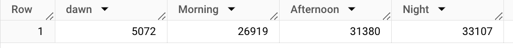

**ASSUMPTION:** I assume that the adjustment in the time of Brail was already done when this data was created.
The time division for Morning, Dawn, Afternoon and Night has been done as following:
Dawn -> 0 - 6
Morning -> 7 - 12 
Afternoon -> 13 - 17 
Night ->  18 - 23 

**INSIGHT:** We can say that the majority of the orders in Brazil are placed during the night time(33,107) followed by order count in the afternoon(31,380). In the morning we have the least number of orders placed (5072) followed by the count of orders in the afternoon(26,919)

**3. Evolution of E-commerce Orders in Brazil Region**

**3.1 month-on-month orders by states**

~~~ SQL
SELECT
 		x.customer_state,
   		x.Year,
   		x.Month,
   		Count(DISTINCT x.order_id) AS total_orders
FROM
   			(SELECT
     			o.order_id,
     			EXTRACT(MONTH FROM o.order_purchase_timestamp) AS Month,
     			EXTRACT(YEAR FROM o.order_purchase_timestamp) AS Year,
     			c.customer_state,
  			FROM `target-case-study-382707.target.orders` AS o
   			LEFT JOIN `target-case-study-382707.target.customers` AS c
   			ON o.customer_id = c.customer_id) AS x
 			GROUP BY x.customer_state,x.Year,x.Month
 			ORDER BY x.customer_state,x.Year,x.Month;	
~~~
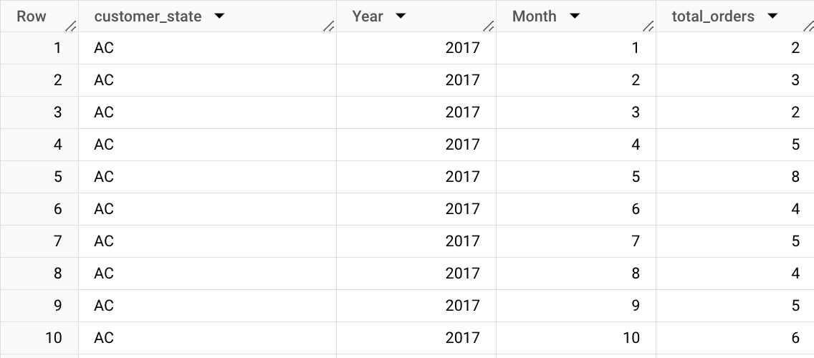

**3.2 Distribution of customers across all the states.**

~~~ SQL
SELECT
   		customer_state,
   		COUNT(DISTINCT customer_id) AS Customer_Per_State,
FROM `target-case-study-382707.target.customers`
   		GROUP BY customer_state
   		ORDER BY Customer_Per_State DESC;
~~~

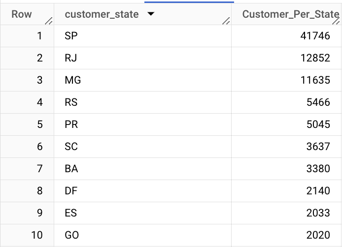

ASSUMING: The customers are the ones who have registered, So no matter if they have made any purchases or not they have been included in the result.

INSIGHTS:  São Paulo (SP) has the highest number of customers with a count of 41,746, followed by Rio de Janeiro (RJ) with 12,852 customers and Minas Gerais (MG) with 11,635 customers.

In Total 27 states, the top 12 states have more than 1000 customers. 13th to 24th have customers of more than 100 but less than 1000. The bottom 3 states have less than 100 customers. 

RECOMMENDATIONS : Focus on retaining customers in states with high customer counts by offering promotions, discounts, or loyalty programs to incentivize repeat purchases.
                  For states with low customer counts, consider targeted marketing campaigns to acquire new customers, such as social media advertising, influencer partnerships, or referral programs.

**4. Impact on the Economy: Trying to analyse the money movement by e-commerce by looking at order prices, freight and others.**

**4.1 Perentage increase in the cost of orders from 2017 to 2018 (including months between Jan to Aug only) - using “payment_value” column in payments table.**

~~~ SQL
With Base as (select
EXTRACT(Year from order_purchase_timestamp) As Year, Sum(payment_value)as revenue
From `target.orders` as t
inner join `target.payments`as p on t.order_id = p.order_id
where EXTRACT(Month from order_purchase_timestamp) between 1 and 8 GROUP BY Year),
base2 as (Select *, Lag(revenue) over (order by Year)as previous_revenue from base )
SELECT *, (revenue-previous_revenue)/previous_revenue*100 as per_INC from base2
~~~
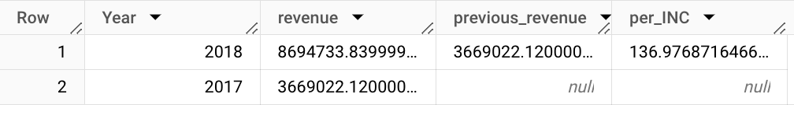

**INSIGHTS :** The revenue in 2018 is significantly higher than in 2017, with a year-over-year increase of 136.98%. 

**RECOMMENDATIONS :** Use the revenue data to inform budgeting and resource allocation decisions, such as increasing investments in marketing or expanding product offerings in high-growth areas.

**4.2)	Mean & Sum of price and freight value by a customer state**

~~~ SQL
SELECT
customer_state,
SUM(price) AS Price_Sum,
SUM(freight_value) AS Freight_Sum,
AVG(price) AS Avg_Price,
AVG(freight_value) AS Avg_Freight FROM
`target.order_items` AS items INNER JOIN
`target.orders` AS o ON
items.order_id = o.order_id INNER JOIN
`target.customers` AS c ON
o.customer_id = c.customer_id GROUP BY
customer_state Order by price_sum
~~~
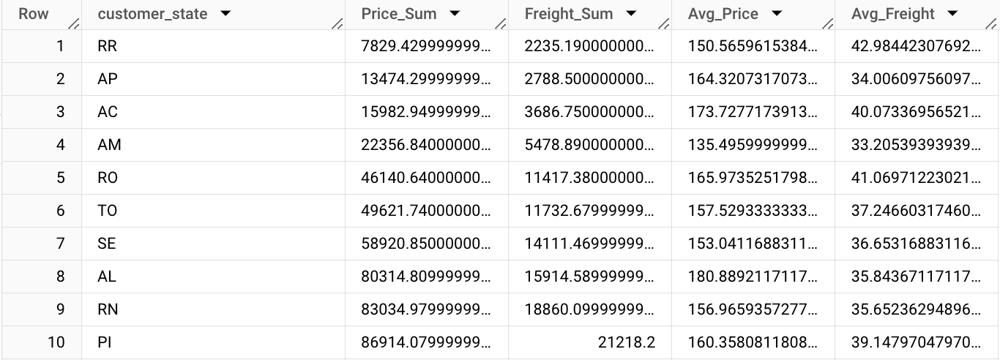

**INSIGHTS :** The highest total price sum is from the state of São Paulo (SP), which is more than twice the price sum of the second-highest state, Rio de Janeiro (RJ). -The highest average price is also from the state of São Paulo (SP), indicating that customers from this state tend to purchase higher-priced items. -The lowest total price sum is from the state of Espírito Santo (ES). -The highest total freight sum is from the state of Minas Gerais (MG), followed by São Paulo (SP) and Rio de Janeiro (RJ). -The highest average freight is from the state of Bahia (BA).

**RECOMMENDATIONS :** The states with higher average prices and freight values may be good targets for marketing campaigns for higher-end products, while those with lower values may be better suited for more affordable products.

**5.Analysis of sales, freight, and delivery time**
**5.1 Calculate days between purchasing, delivering and estimated delivery**

~~~ SQL
SELECT
 	order_purchase_timestamp,
 	order_estimated_delivery_date,
 	order_delivered_customer_date,
 	estimated_day,
 	Delivery_time,
     (estimated_day-Delivery_time) AS buffer_day FROM (
     SELECT
 	order_purchase_timestamp,
 	order_estimated_delivery_date,
 	DATE_DIFF(order_estimated_delivery_date, order_purchase_timestamp, DAY) AS estimated_day,
 	order_delivered_customer_date,
 	DATE_DIFF(order_delivered_customer_date, order_purchase_timestamp, DAY) AS Delivery_time

FROM
 	`target.orders`
     WHERE
 	order_delivered_customer_date IS NOT NULL)
 	order by buffer_day
~~~

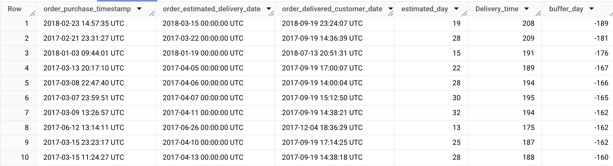

**INSIGHT - ** There is a late delivery of max 189 days and there are several orders having this late delivery.
**RECOMMENDATIONS - ** we can analyze the reason for the late delivery and give the correct estimated_delivery_date to the customer.

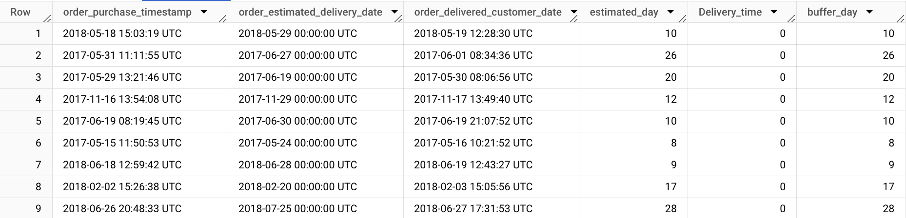

**INSIGHT**- After sorting data by Delivery_time we can see there is an order which is delivered on the same day or in 1 day.
**RECOMMENDATIONS-** We can encourage these customers to give good reviews on our online platform or in google my business.

**5.2 Analysing time_to_delivery & diff_estimated_delivery. Formula for the same given below:**

    - time_to_delivery = order_purchase_timestamp - order_delivered_customer_date
    - diff_estimated_delivery = order_estimated_delivery_date - order_delivered_customer_dat

~~~ SQL
SELECT
 	order_purchase_timestamp,
 	order_delivered_customer_date,
 	DATE_DIFF(order_delivered_customer_date, order_purchase_timestamp, DAY) AS time_to_delivery
FROM `target.orders`
    WHERE order_delivered_customer_date IS NOT NULL 
    ORDER BY time_to_delivery
~~~

**INSIGHT - ** some orders being delivered within a day while others take over 200 days. 
**RECOMMENDATIONS - **Optimize logistics processes and consider partnering with reliable carriers to ensure timely deliveries.

~~~ SQL
SELECT
order_purchase_timestamp, order_estimated_delivery_date,
DATE_DIFF(order_estimated_delivery_date, order_purchase_timestamp, DAY) AS diff_estimated_delivery
FROM
`target.orders` WHERE
order_delivered_customer_date IS NOT NULL ORDER BY
diff_estimated_delivery DESC
~~~
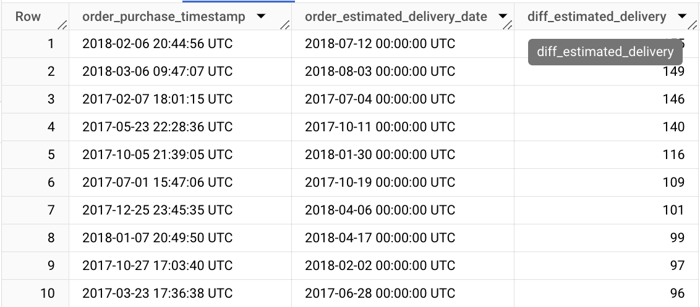

~~~ SQL
/*Grouping data by state, take mean of freight_value, time_to_delivery, diff_estimated_delivery*/
SELECT
customer_state, AVG(freight_value) AS Avg_Freight,
AVG(time_to_delivery) AS Avg_time_to_delivery, AVG(diff_estimated_deliver) AS Avg_diff_estimated_deliver, FROM
(SELECT
     customer_state,
     DATE_DIFF(order_delivered_customer_date, order_purchase_timestamp, DAY) AS time_to_delivery,
     DATE_DIFF(order_estimated_delivery_date, order_purchase_timestamp, DAY) AS diff_estimated_deliver,
     freight_value FROM
     `target.order_items` AS items INNER JOIN
     `target.orders` AS o ON
     items.order_id = o.order_id INNER JOIN
     `target.customers` AS c ON o.customer_id = c.customer_id
WHERE order_delivered_customer_date IS NOT NULL)
  GROUP BY customer_state
  Order by Avg_time_to_delivery desc
~~~

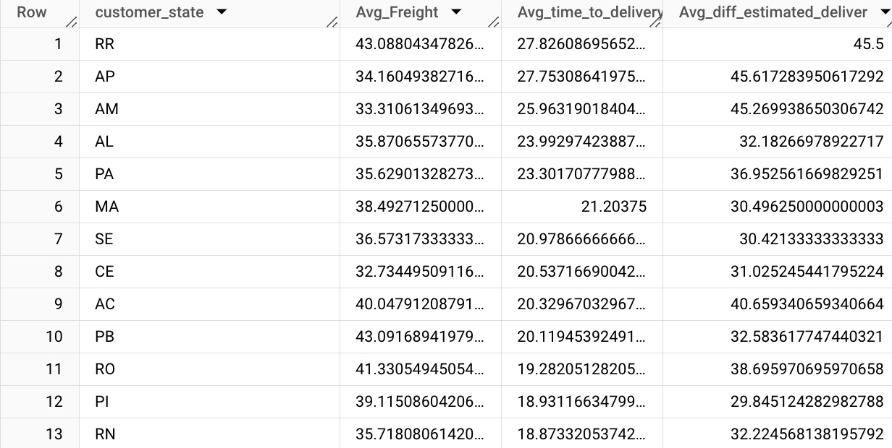

**5.4 Top 5 states with highest/lowest average freight value - sort in desc/asc limit 5**

~~~ SQL
SELECT customer_state,AVG(freight_value) AS Avg_Freight
FROM
(SELECT
 	customer_state,
 	DATE_DIFF(order_delivered_customer_date, order_purchase_timestamp, DAY) AS time_to_delivery,
 	DATE_DIFF(order_estimated_delivery_date, order_purchase_timestamp, DAY) AS diff_estimated_deliver,
 	freight_value
  FROM `target.order_items` AS items
     INNER JOIN `target.orders` AS o
     ON items.order_id = o.order_id
     INNER JOIN `target.customers` AS c
     ON o.customer_id = c.customer_id
     WHERE order_delivered_customer_date IS NOT NULL)
GROUP BY customer_state
ORDER BY Avg_Freight DESC LIMIT 5;
~~~
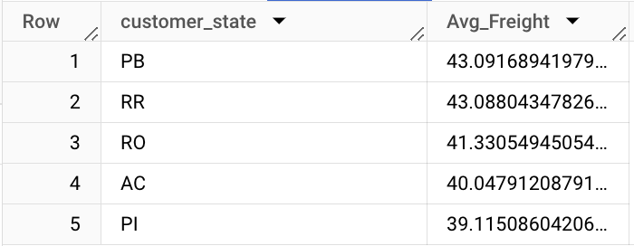

**Top 5 states with highest/lowest average time to delivery**

~~~ SQL
SELECT
customer_state,
AVG(time_to_delivery) AS Avg_time_to_delivery FROM
(SELECT
customer_state,
DATE_DIFF(order_delivered_customer_date, order_purchase_timestamp, DAY) AS time_to_delivery
FROM
`target.order_items` AS items INNER JOIN
`target.orders` AS o ON
items.order_id = o.order_id INNER JOIN
`target.customers` AS c ON
o.customer_id = c.customer_id WHERE
order_delivered_customer_date IS NOT NULL) GROUP BY customer_state
ORDER BY Avg_time_to_delivery DESC LIMIT 5;
~~~
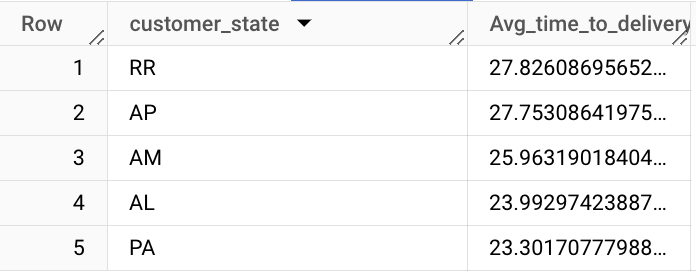

~~~ SQL
  /*Top 5 states where delivery is really fast/ not so fast compared to estimated date*/
SELECT
  customer_state,
  AVG(diff_estimated_delivery) AS diff_estimated_delivery
FROM (
  SELECT
    customer_state,
    order_estimated_delivery_date,
    order_delivered_customer_date,
    DATE_DIFF(order_estimated_delivery_date,order_delivered_customer_date, DAY) AS diff_estimated_delivery
  FROM `target.order_items` AS items
  INNER JOIN `target.orders` AS o
  ON items.order_id = o.order_id
  INNER JOIN `target.customers` AS c
  ON o.customer_id = c.customer_id
  WHERE order_delivered_customer_date IS NOT NULL)
GROUP BY customer_state
ORDER BY diff_estimated_delivery ASC
LIMIT 5;
~~~
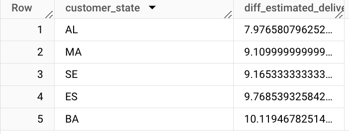

**6.Payment type analysis:**

**6.1 Month over Month count of orders for different payment types**

~~~ SQL
WITH
  Base AS(
  SELECT
    Payment_type,Month,Year,
    COUNT(DISTINCT(order_id)) AS Customer_count,
  FROM (
    SELECT
      o.customer_id,p.payment_type,o.order_id,
      EXTRACT(Month
      FROM
        order_purchase_timestamp) AS Month,
      EXTRACT(Year
      FROM order_purchase_timestamp) AS Year
    FROM `target.orders` AS o
    LEFT JOIN `target.payments` AS p
    ON o.order_id = p.order_id)
  GROUP BY payment_type,Month,Year
  ORDER BY Payment_type,Year,Month),
  base2 AS (
  SELECT *,
    LAG(Customer_count) OVER (PARTITION BY Payment_type ORDER BY Year, Month )AS previous_Customer_count
  FROM base )
SELECT *,
  (Customer_count-previous_Customer_count)/previous_Customer_count*100 AS per_INC
FROM base2
~~~
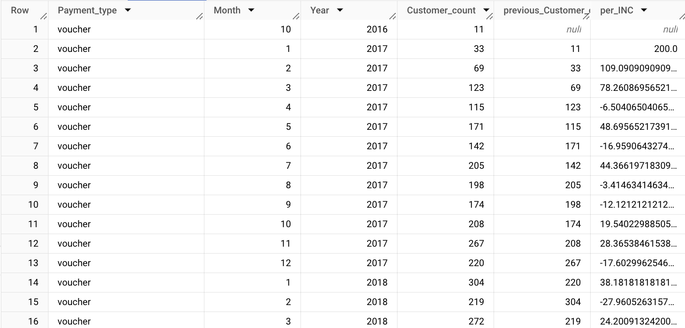

**6.2 Count of orders based on the no. of payment installments**
~~~ SQL
Select payment_installments,
Count(distinct order_id) as order_count FROM
`target.payments`
GROUP BY payment_installments order by order_count DESC
~~~
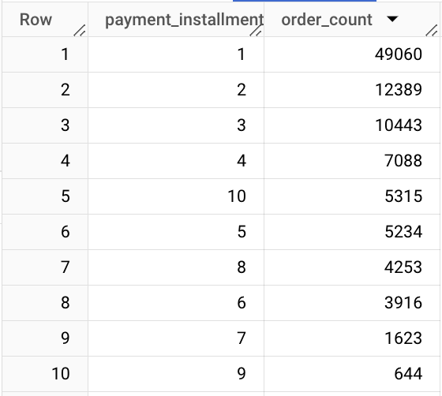

